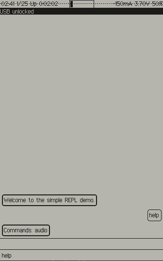

# REPL

A simple demo application that provides a bare-bones REPL framework.
## Copying This Demo to a New App

1. Add a UX context by editing `services/gam/src/lib.rs/EXPECTED_BOOT_CONTEXTS`
2. Copy this demo application, and rename the relevant structures in its `Cargo.toml` and `main.rs`.
3. Add it to the Workspace `default-members` and `members` arrays by editing `./Cargo.toml`
4. Add it to the build by editing `xtask/src/main.rs` and inserting it into the relevant descriptor. Typically, you would insert your app into the `hw_pkgs` array, as this is what is built and targeted for full hardware builds. Most of the other trimmed-down descriptors are for debug, emulation, and benchmarking.
5. (optional) You may also need to run `cargo xtask generate-locales` if you modify/add any internationalization strings.
6. Add entries to the app switching menu. `services/status/src/appmenu.rs` to add the menu item (plus `locales/i18n.json` in the status directory if you want translated names for the app), and `services/status/src/main.rs` to add the Opcode (inside the `StatusOpcode` struct, around line 55) and the actual operation itself (in the main `loop`, around line 670).

## Details



`repl` is a baseline demo application for Xous. It uses a chat-client
style interface (stacking bubbles of text, with user input right-aligned
and shell feedback left-aligned) to facilitate interactions.

It implements the basic envisioned structure of a Xous application, namely:

 - Text input comes via the `ime-frontend`
 - Graphical output is rendered via the `gam`

The one demo command provisioned in the `repl` app plays a tone via
the `codec` service. This was chosen because it is about one of the most complicated
and comprehensive things you can do in the `repl` environment, as it requires
real-time callbacks to fill the audio buffer with new samples. If you have
specific questions about how the callbacks work, we encourage you to open
an issue in this repo and ask your question. Your questions will help us
direct effort toward building the documentation base.

To make your own command, copy the `audio.rs` template
in the `apps/repl/src/cmds/` directory, or use this very basic `echo`
template:

```Rust
use crate::{ShellCmdApi, CommonEnv};
use xous_ipc::String;

#[derive(Debug)]
pub struct Echo {
}

impl<'a> ShellCmdApi<'a> for Echo {
    cmd_api!(echo); // inserts boilerplate for command API

    fn process(&mut self, args: String::<1024>, _env: &mut CommonEnv) -> Result<Option<String::<1024>>, xous::Error> {
        Ok(Some(rest))
    }
}
```

The "verb" is the name of your command, and it is the argument to the `cmd_api!()` macro.

`process()` is your "main" function, and `args` is a string which contains the
rest of the line that was typed into the chat, minus the verb used to identify
your command (e.g. the arguments, but not tokenized or parsed in
any way). `env` contains some items in a common environment, for example, connections
to the GAM, LLIO server or other resources required by your implementation.

Once you've added your command to the directory, go to the `cmds.rs` file, and follow
the four-step instructions embedded within the file, starting around line 40.
