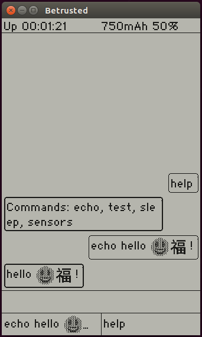

# Shell Chat



`shellchat` is a baseline demo application for Xous. It uses a chat-client
style interface (stacking bubbles of text, with user input right-aligned
and shell feedback left-aligned) to facilitate interactions with the hardware.
It implements the basic envisioned structure of a Xous application, namely:

 - Text input comes via the `ime-frontend`
 - Graphical output is rendered via the `gam`

Other facilities for handling system-level messages, such as menu configurations
and network events, have yet to be implemented. However, they will likely end up
with a demo in this application first.

To make your own command, copy the `echo.rs` template or snag the one below, and put
it in the services/shellchat/src/cmds/ directory:

```Rust
use crate::{ShellCmdApi, CommonEnv};
use xous_ipc::String;

#[derive(Debug)]
pub struct Echo {
}

impl<'a> ShellCmdApi<'a> for Echo {
    cmd_api!(echo); // inserts boilerplate for command API

    fn process(&mut self, args: String::<1024>, _env: &mut CommonEnv) -> Result<Option<String::<1024>>, xous::Error> {
        Ok(Some(rest))
    }
}
```

The "verb" is the name of your command, and it is the argument to the `cmd_api!()` macro.

`process()` is your "main" function, and `args` is a string which contains the
rest of the line that was typed into the chat, minus the verb used to identify
your command (the arguments, as they may be, but not tokenized or parsed in
any way). `env` contains some items in a common environment, for example, connections
to the GAM, LLIO server or other resources required by your implementation.

Once you've added your command to the directory, go to the `cmds.rs` file, and follow
the four-step instructions embedded within the file, starting around line 40.

## Things to Keep in Mind
- Xous is currently `nostd`
- When you're done adding your command, you should be able to do a `cargo xtask run` and it will fire up an emulated environment, like the one above
- Type...very...slowly...and hold down keys when using the emulated environment.
